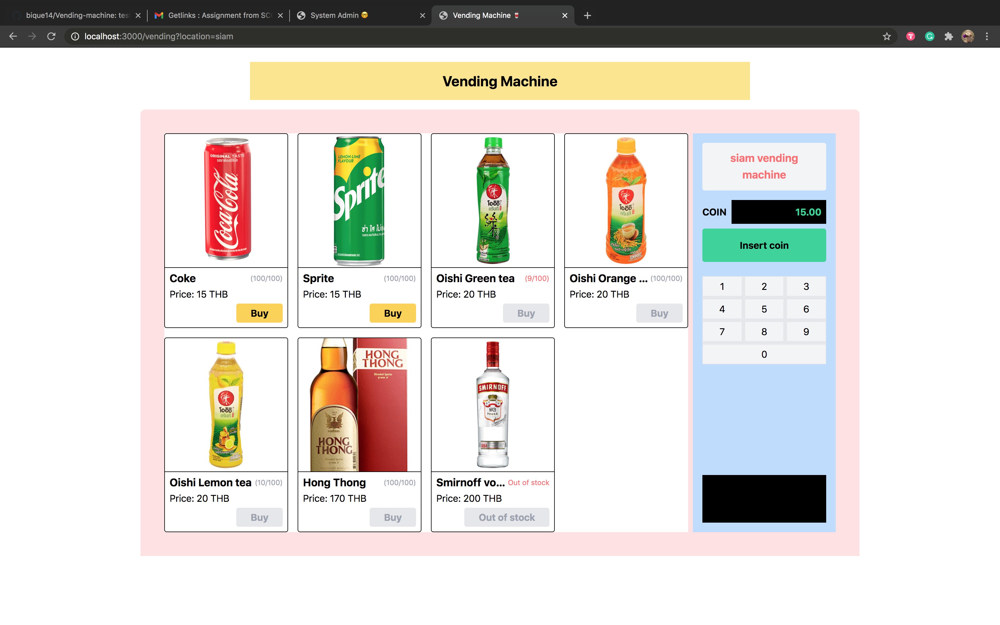

# Vending Machine

## Table of contents

- [Project architecture](#project-architecture)
- [Development](#development-steps)
- [API](backend/README.md)
- [Pages view](#pages-view)
- [Example website](example.md)

## Project architecture

Frontend: Nuxt.js

Backend: Nest.js

Database: MongoDB

---

## Development steps

#### Prerequisite

- Start database [MongoDB](https://www.mongodb.com/3)

#### One line installation

For install frontend and backend packages

```
$ make init
```

#### Run Frontend

```
$ make front
```

###### frontend server running at `localhost:3000`

#### Run Backend

```
$ make back
```

###### backend server running at `localhost:3001`

---

## Pages view

#### Client page

Running at `localhost:3000/vending?location=<location>`

> example: localhost:3000/vending?location=siam



#### Admin page

Running at `localhost:3000/admin`


