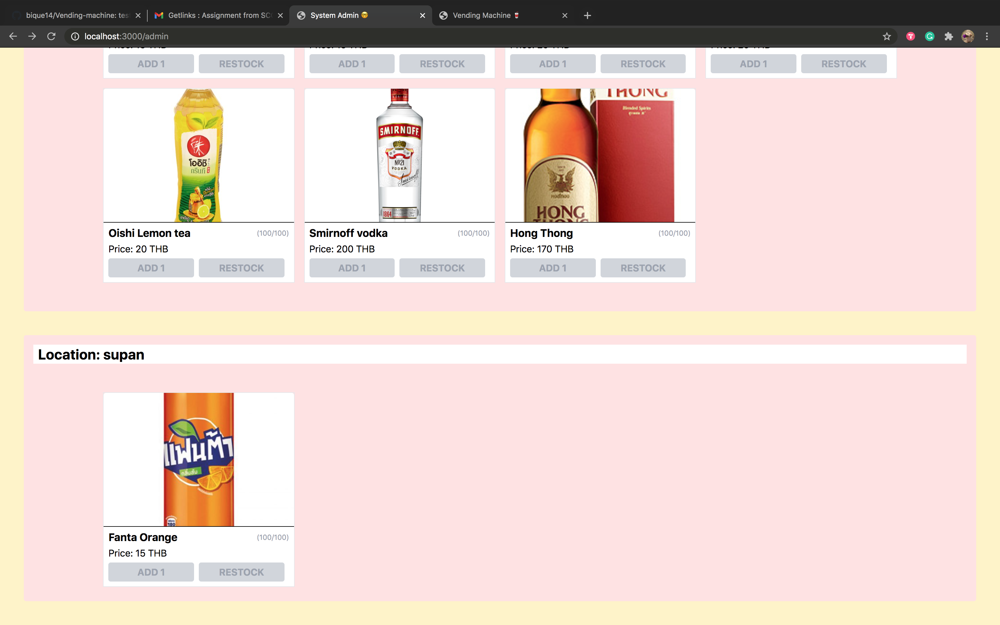

# Example

## Client

ฝั่งผู้ใช้ จะสามารถเห็นสินค้าได้เฉพาะแค่กับโลเคชั่นนั้นๆ และสามารถเลือกซื้อสินค้าได้

### Normal flow

1. ผู้ใช้มีเงิน 15 บาท ผู้ใช้จะซื้อน้ำได้ไม่เกินจำนวนเงินที่มี
   

2. ผู้ใช้กดหยอดเหรียญเพิ่ม ทำให้ผู้ใช้มีเงิน 20 บาท และมีตัวเลือกในการซื้อเพิ่มขึ้น
   

3. ผู้ใช้เลือกซื้อน้ำดื่ม(โออิชิสีเหลือง) ที่ตอนแรกมี 10 ขวด แต่เมื่อผู้ใช้ซื้อไปจึงเหลือ 9 ขวด จำนวนคงเหลือจึงเปลี่ยนเป็นสีแดง
   

### Alternative flow

- แม้ว่าผู้ใช้จะมีเงินมากมายแค่ไหน แต่เมื่อสินค้าหมด stock ก็ไม่สามารถซื้อได้
  

- ผู้ใช้ที่ไม่มีเงิน จะไม่สามารถซื้ออะไรได้เลย จนกว่าจะหยอดเหรียญเพิ่ม
  

---

## Admin

ฝั่งแอดมินจะสามารถเห็นรายการสินค้าได้ทั้งหมด โดยจะแบ่งสินค้าตามแต่ละ location และสามารถเติม stock สินค้าเพิ่มได้

1. เมื่อสินค้าใกล้หมด(น้อยกว่า 10) จะมี notification แจ้งเตือน admin
   
   
   

2. admin สามารถเติมของเข้า stock ได้ ซึ่งสามารถเลือกได้ว่าจะเติมทีละ 1 รายการ หรือเติมจนเต็ม capacity
   
   

3. เมื่อ admin เติมสินค้าเต็มจำนวน capacity ฝั่งแอดมินจะไม่สามารถเติม stock ได้
   
   
